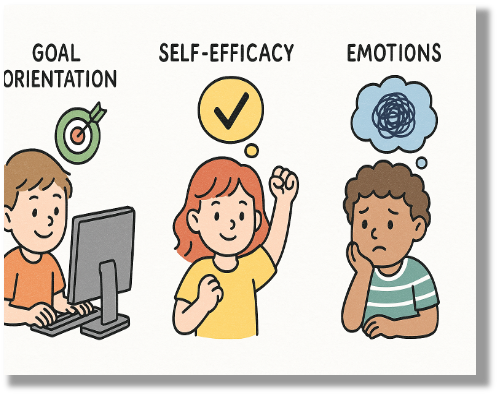
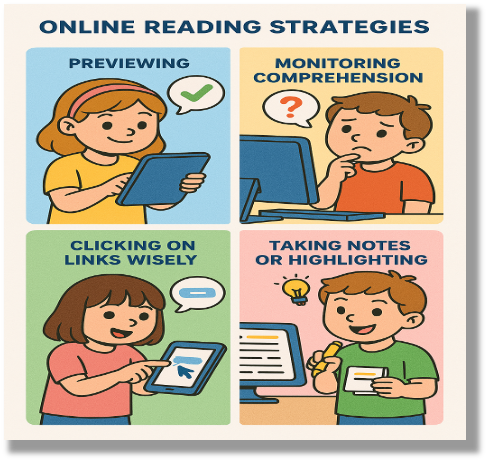
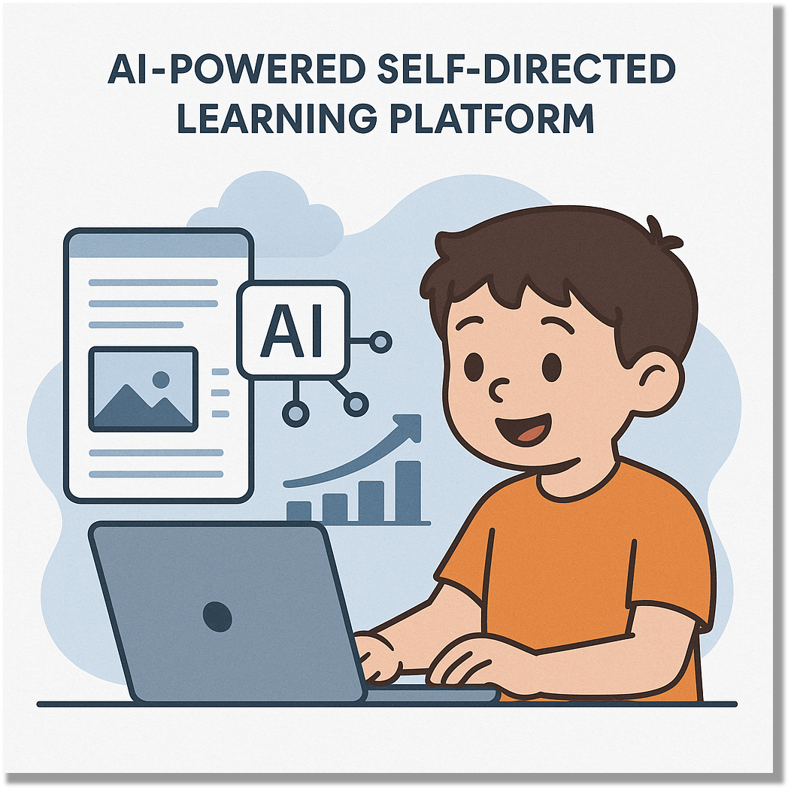

This research is conducted under the supervision of Prof. Zhu Xinhua and in collaboration with Prof. Cheong ChooMui from the University of Hong Kong.

## Background
The digital age has fundamentally transformed literacy. With the proliferation of online resources and user-generated content, multimodal texts combining images, videos, and written content have become ubiquitous in our daily information consumption. Modern literacy now extends beyond traditional reading to include the ability to navigate, comprehend, and meaningfully interact with digital technology.

Recognizing this evolution, the Progress in International Reading Literacy Study developed the e-PIRLS assessment in 2016 to evaluate students' online reading abilities through simulated web browsing experiences. Set to be implemented worldwide in 2026 across 60 participating countries and regions including Hong Kong, this initiative underscores that effective online reading has become an essential 21st-century skill.

## Research Focus

**1. Psychological Mechanisms and thier Relationships with Reading Performance**

This focus takes a person-centered approach to investigate the cognitive and psychological processes students engage during online multimodal reading. Specifically, it examines how motivational factors (such as goal orientations, emotions and self-efficacy) and cognitive factors (such as reading strategies) relate to online reading performance, with particular attention to individual differences among learners.  This is also the theme of my 
[doctoral dissertation](https://research.polyu.edu.hk/en/studentTheses/individual-profiles-in-online-reading-relations-between-default-p/).

  
  

**2. Technology-Enhanced Self-Directed Learning**

This focus will translate findings from the focus 1 into practice by developing an AI-powered self-directed learning platform. By integrating AI technology, this platform will help students enhance their online reading strategies, regulate positive psychological states, and ultimately improve their online multimodal reading performance. This work will represent the practical application of research insights to support learners' autonomous development in digital literacy.

## Related Papers
**📑 Published**

<strong>Zhu, S.</strong>, Zhu, X., Yao, Y., & Cheong, C. (2025). Profiling the differences in strategy use in online multimodal reading: Associations with self-efficacy and reading task performance. <em>Studies in Educational Evaluation</em>, <em>87</em>, 101507. [SSCI, Q1, IF = 3.7] https://doi.org/10.1016/j.stueduc.2025.101507

**✏️ Submitted**

<strong>Zhu, S.</strong>, Cheong, C., & Zhu, X. (2025 expected). The reciprocal relationships between anxiety, self-efficacy, and online multimodal reading performance: Evidence from a three-wave multiple-indicators random intercept cross-lagged model. <em> Contemporary Educational Psychology</em>. (Under review). 

<strong>Zhu, S.</strong>, Yao, Y., Cheong, C., & Zhu, X. (2025 expected). Latent psychological profiles and their effects on strategy use and performance in online multimodal reading tasks: A mixed-methods investigation. <em>Learning and Instruction</em>. (Under review). 

